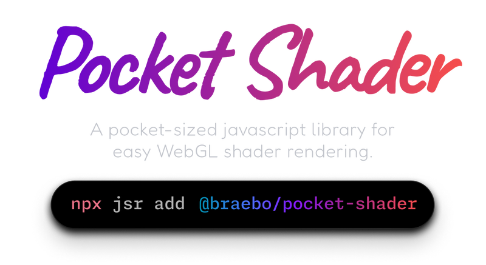

<div align="center">

<a href="https://pocket-shader.braebo.dev" target="_blank" rel="noopener">
    
</a>

</div>

### _This project is still early-alpha, so the API is unstable.  I'd love to hear your feedback / ideas!_

<br />

- 📦 Simple API
- 🐭 Lightweight - _2.63 kB_
- ✅ Typesafe
- 👌 Zero Dependencies
- 🌐 ESM

<br />

## Installation

```bash
npx jsr add @braebo/pocket-shader
```

## Documentation

[https://pocket-shader.braebo.dev/](https://pocket-shader.braebo.dev/)

## RoadMap

- [x] Fragment / Vertex Shaders
- [x] Responsive / Automatic Resizing
- [x] (Reactive) Custom Uniforms
- [x] Render Loop
- [x] Playback Controls
- [x] Mouse Input
- [x] Mouse Smoothing
- [x] Render Hook
- [ ] Texture Support
- [ ] WebGPU
- [ ] Auto Pause/Resume _(Intersection Observer)_

## Contributing

Just remember to include a changeset with your pr:

```bash
pnpm changeset
```
