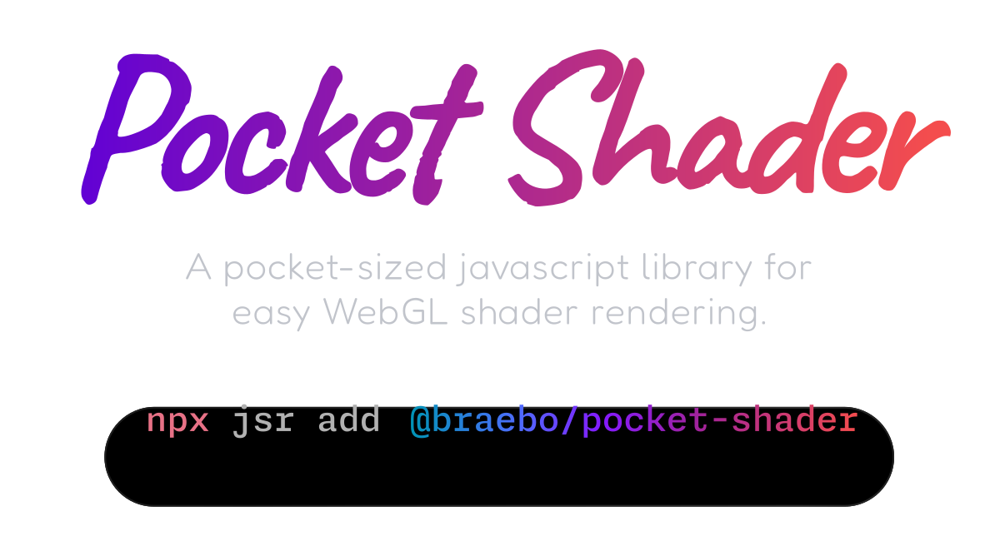

<div align="center">



</div>

<br />

- ✅ Fully Typed
- 👌 Zero Dependencies
- 📦 Simple API
- 🌐 ESM Only
- 🐭 Lightweight - _2.63 kB_

<br />

## Installation

```bash
npx jsr add @braebo/pocket-shader
```

## Documentation

[https://pocket-shader.braebo.dev/](https://pocket-shader.braebo.dev/)

## RoadMap

- [x] Fragment / Vertex Shaders
- [x] Responsive / Automatic Resizing
- [x] (Reactive) Custom Uniforms
- [x] Render Loop
- [x] Playback Controls
- [x] Mouse Input
- [x] Mouse Smoothing
- [x] Render Hook
- [ ] Texture Support
- [ ] WebGPU
- [ ] Auto Pause/Resume _(Intersection Observer)_
